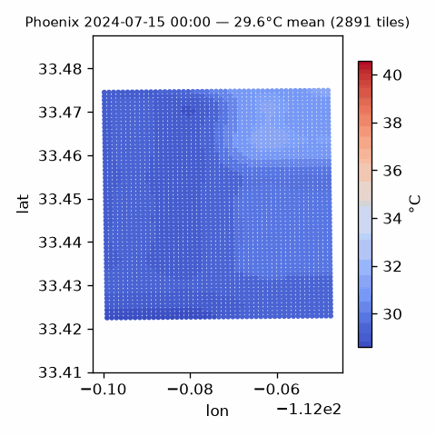
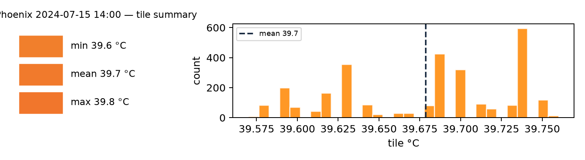

# calorai

Physics-first city heat-budget auditor for the **FortyGuard Hackathon'26,
Track 6 - Agentic AI**.

calorai turns a FortyGuard temperature layer into an auditable action plan:
where a district is hot, why it is hot, which intervention cools it most, what
it costs, and what an agent would do next.

> Submission status: live demo URL and video link are added after Render
> deployment. The app also runs fully in mock mode, with no API key and no
> credits spent.



*Above: our 24-hour analysis — 24 single-hour tcm heatmaps stitched into an animated GIF (Phoenix, 2024-07-15, 00:00–23:00). Each frame is a real FortyGuard tile field from `data/cache` (analysis we pulled and cached ourselves, not a screenshot of the template). The southeast heat island breathes with the sun; the color scale is fixed (28.6–40.6 °C) so the diurnal pulse is honest.*



*The one-line summary card every use-case notebook prints — reproduced here from our own Phoenix 14:00 audit (not a copy of the template's example). Min/mean/max swatches, a colored histogram of every tile's peak, and a continuous colorbar on the same fixed scale as the GIF.*

## Judge Quick Scan

| Item | Where |
|---|---|
| Product | FastAPI + single-page UI at `/` |
| Primary track | Track 6 - Agentic AI |
| Flagship story | One district, one heat problem, three interventions |
| Main endpoints | `/api/analysis`, `/api/ask`, `/api/report`, `/api/export`, `/api/health` |
| Live deployment | Pending Render URL |
| Video | Pending YouTube/Loom URL |
| 500-word summary | [CONCEPT.md](CONCEPT.md) |
| AI disclosure | [AI_DISCLOSURE.md](AI_DISCLOSURE.md) |
| Physics citations | [docs/physics-references.md](docs/physics-references.md) |
| ML validation | [docs/ml-validation.md](docs/ml-validation.md) |
| What does not work yet | [What Doesn't Work Yet](#what-doesnt-work-yet) |

## What It Does

calorai is not only a heatmap viewer. It reads temperature and environmental
layers, then runs a first-principles urban heat budget:

```text
absorbed solar + longwave exchange + storage - convection - latent cooling
    -> predicted surface temperature -> risk -> intervention ranking
```

The product returns:

- Tile-level heat audit for Phoenix, Maryvale, Vegas Strip, Manhattan, San
  Jose, Chicago, Austin, and East Harlem.
- Physics attribution: solar absorption, canyon trapping, sky temperature,
  storage, wind-aware convection, latent cooling.
- Human-risk blocks: WBGT, humidex, vulnerability score, productivity loss,
  downburst diagnostic, heat-wave/fire-weather watches.
- Action blocks: cool roof, shade, pavement, facade, misting schedule, water
  budget, retrofit ROI.
- Agentic interface: natural-language prompt -> tool plan -> trace -> answer.
- Exports: PDF report plus GeoJSON/CSV ZIP for external planning tools.

## Why It Matters

City heat teams, real-estate owners, and outdoor-work planners do not only need
to know that a place is hot. They need to know which physical lever to pull:
reflect roofs, add shade, change shifts, activate misting, or prioritize a
block for capital work.

calorai keeps that decision traceable. Every number is either from the
FortyGuard Temperature API, a documented physics equation, or a stated
assumption returned in the payload.

## Measured Result

Live FortyGuard run, Phoenix, `2024-07-15 14:00`:

| Metric | Result |
|---|---|
| Cells returned | 2,891 |
| Tile temperature range | 39.57-39.76 C |
| Dominant heat load | Solar absorption, about 96-97% of positive load |
| WBGT | 28.5 C, high |
| Top intervention | Cool roofs |
| Modeled cooling | -13.0 C |
| Vulnerability score | 84/100, critical |

The ML surrogate was validated against a cached 24-hour Phoenix series:
surrogate MAE vs tile max was 9.54 C; closed-form physics MAE was 11.74 C;
surrogate-vs-physics MAE was 2.46 C. The gap is documented honestly as a
skin-temperature vs canopy/tile-layer semantics boundary.

## Why lakes and canyons matter (what 3D shows)

- **Lake Michigan cools Chicago by ~2–3 K (diagnostic `lake_effect.cooling_lever_K`) — Vegas Strip has no such lever.** The same sun, but the lake's evaporative boost (`evaporative_fraction` + lake share ×0.15) is free cooling. Our `GET /api/uhi` ranking makes it visible: Vegas Strip 59.1 high vs Chicago 32.8 low.
- **Canyon traps heat; valleys pool it.** Manhattan h/w 1.5 (`sky_view_factor` 0.35, `radiative_environment_c` warmer) vs Phoenix h/w 0.5 — 3D draped heat (Re:Earth terrain, no Google key, toggle 2.5D Phoenix / 3D Manhattan) lets a planner *see* why a valley-bottom + high `overnight_retention` is a pooling risk and a ridge + strong `thermal_wind.gradient_k_per_km` is ventilated. `geomorphology.landform` (Iwahashi & Pike) marks it.

Both are honest proxies (breeze 0.4 m/s per K ΔT, no observed wind; landform is district-scale 3×3, not catchment hydrology) and both are mocked for zero-credit demo.

## Architecture

```text
FortyGuard API / cached mock data
        |
        v
calorai.data_source
        |
        v
AuditAgent
        |
        +-- physics/     radiation, canyon, inertia, stress, mitigation, thermal-wind (Wallace & Hobbs Eq. 7.20), flight DA
        +-- analyst/     equity, productivity, economy, synoptic, landcover, terrain (Re:Earth), geomorphology, lake_effect, uhi
        +-- ml/          forecast surrogate and anomaly detector
        +-- responder/   misting and heat-response plans
        +-- sentinel/    declarative alert rules R1-R13
        |
        v
FastAPI + UI (MapLibre 2.5D + Cesium globe toggle, no bill) + PDF + export + natural-language tool trace
```

## Credit & provenance

calorai was built **from** the official starter [`FortyGuard-Tech/temperature-api-quickstart`](https://github.com/FortyGuard-Tech/temperature-api-quickstart) (MIT). The `fortyguard/` client, `notebooks/00_*.ipynb` through `05_*.ipynb`, and the base parcel heatmaps in `data/` are theirs; the `calorai/` agent, physics, analyst, responder, sentinel, ML, `ui/`, `calorai_demo.ipynb`, and the 24-h GIF/card above are ours. Full split is in [`ACKNOWLEDGEMENTS.md`](ACKNOWLEDGEMENTS.md). The GIF and summary card are our analysis, not a copy — re-rendered with our palette (`coolwarm`, fixed scale) from our cached Phoenix fields.

## Run Locally

Python 3.10+ is recommended.

```bash
python -m venv .venv
# Windows
.venv\Scripts\activate
# macOS / Linux
source .venv/bin/activate

pip install -r requirements.txt
```

Run the web app:

```bash
python -m calorai serve
```

Open `http://127.0.0.1:8000`.

Run an offline audit:

```bash
python -m calorai audit phoenix --date 2026-08-18 --hour 14 --mock
```

Ask the agent:

```bash
python -m calorai ask "plan tomorrow for Maryvale" --mock
```

Run tests:

```bash
.venv\Scripts\python.exe -m pytest -q
```

The test suite is pinned to mock data in [tests/conftest.py](tests/conftest.py),
so it is deterministic, offline, and zero-credit.

## Live API Mode

Create `.env` from the template:

```bash
cp .env.example .env
```

Add:

```env
FORTYGUARD_API_KEY=fg_live_xxxxxxxxxxxxxxxx
FORTYGUARD_BASE_URL=https://api.fortyguard.com
```

Then call endpoints with `source=live` or omit source and let the app use live
when a key is present. During the hackathon workflow, live API calls are
approval-gated and cache-first because credits are finite.

## API Examples

Health:

```bash
curl http://127.0.0.1:8000/api/health
```

Curated UI payload:

```bash
curl "http://127.0.0.1:8000/api/analysis?district=phoenix&date=2026-08-18&hour=14&source=mock"
```

Natural-language agent:

```bash
curl -X POST http://127.0.0.1:8000/api/ask ^
  -H "Content-Type: application/json" ^
  -d "{\"query\":\"should we mist Maryvale tomorrow?\",\"district\":\"maryvale\",\"source\":\"mock\"}"
```

Real FortyGuard response excerpt from the cached Phoenix live run:

```json
{
  "district": "Phoenix, AZ",
  "date": "2024-07-15",
  "source": "live",
  "snapshot": {
    "hour": 14,
    "n_cells": 2891,
    "min_c": 39.57,
    "mean_c": 39.68,
    "max_c": 39.76
  },
  "exposure": {
    "wbgt_c": 28.5,
    "level": "high"
  },
  "interventions": [
    {
      "name": "Cool roof / high-albedo coating",
      "delta_t_c": -13.0
    }
  ]
}
```

## Deployment

Render support is checked in:

- [render.yaml](render.yaml): free Python web service.
- [Procfile](Procfile): gunicorn start command.
- [.github/workflows/keepalive.yml](.github/workflows/keepalive.yml): optional
  health ping when the `LIVE_URL` repository variable is set.

The deployed app must open in a fresh/incognito browser with no login and no
install. If `FORTYGUARD_API_KEY` is absent, it falls back to mock mode.

## Project Layout

```text
calorai/
  agent.py              audit orchestrator and report contract
  main.py               FastAPI app
  tools.py              agent tool registry
  planner.py            NL planner with deterministic fallback
  physics/              first-principles heat-budget modules
  analyst/              equity, economy, statistics, landcover, synoptic blocks
  responder/            misting and heat-response plans
  sentinel/             alert rules
  ml/                   forecast surrogate and anomaly detector
ui/                     single-page web dashboard
tests/                  offline mock-pinned tests
docs/                   validation, references, API notes, roadmap
notebooks/              FortyGuard template notebooks and use cases
fortyguard/             official FortyGuard client from the starter template
data/                   committed sample/cached demo data only
```

See [ACKNOWLEDGEMENTS.md](ACKNOWLEDGEMENTS.md) for what came from the official
FortyGuard template versus original calorai work.

## Notebooks

The starter notebooks remain available for endpoint walkthroughs and offline
parcel use cases:

| Notebook | Purpose |
|---|---|
| [00_setup.ipynb](notebooks/00_setup.ipynb) | auth and credit check |
| [01_create_heatmap.ipynb](notebooks/01_create_heatmap.ipynb) | heatmap endpoint |
| [02_environmental_parameters.ipynb](notebooks/02_environmental_parameters.ipynb) | env parameters |
| [03_satellite_segmentation.ipynb](notebooks/03_satellite_segmentation.ipynb) | satellite segmentation |
| [04_street_view_segmentation.ipynb](notebooks/04_street_view_segmentation.ipynb) | street-view segmentation |
| [05_heat_intelligence_report.ipynb](notebooks/05_heat_intelligence_report.ipynb) | premium PDF report |
| [calorai_demo.ipynb](notebooks/calorai_demo.ipynb) | mock-safe calorai demo |

### Use calorai's layers in your own workflow

The template notebooks teach the *endpoints*. calorai teaches the *audit* — combine them:

- **Real-estate heat screening** → run `POST /v1/heatmap` for your AOI, then `POST /api/analysis` for that district/date; join the tile GeoJSON export (`/api/export`) with your parcel polygons to rank sites by `analysis.equity.quintile_gap_c` and `exposure.wbgt_c`.
- **Bus-stop / shade prioritization** → fetch `GET /api/analysis?district=maryvale` (canyon + shade physics already in `physics/canyon.py`), then add your stop points; the hottest tiles on the inflow axis (`thermal_wind.ventilation_corridors`) are where shade pays most.
- **Outdoor-work planning** → `GET /api/analysis` gives you `schedule` (24h OSHA work/rest) and `synoptic` (heat-wave/dome/fire VPD) — no extra pulls, just the diurnal series you already fetched.
- **Evidence pack for a client** → `GET /api/report` PDF + `GET /api/export` ZIP + the summary card above — all deterministic, all citation-backed (`docs/physics-references.md`).

All of the above run in **mock mode** (no key) — see `tests/conftest.py` pin — and switch to `source=live` when you add `.env`.

## What Doesn't Work Yet

- The live demo URL is not filled until Render deployment is complete.
- The app is U.S.-only because the FortyGuard API coverage is U.S.-only for
  this workflow.
- Live runs are pinned to catalog-proven dates such as `2024-07-15`; current or
  future dates may return zero cells because catalog availability can lag.
- The wind field is a relative thermal-wind proxy, not observed wind, because
  the current API payload does not ship wind speed.
- The ML model is a physics surrogate, not a direct predictor of the tcm tile
  layer. The validation gap is documented in [docs/ml-validation.md](docs/ml-validation.md).
- No real IoT mist valves are controlled. The responder emits a water/cooling
  schedule and assumptions only.
- Census/ACS equity overlays, bus-stop imports, energy-grid demand coupling,
  insurance pricing, and cyclone coupling are roadmap items, not shipped
  claims. See [docs/roadmap.md](docs/roadmap.md).

## Useful Docs

- [CONCEPT.md](CONCEPT.md): 500-word submission summary.
- [docs/physics-references.md](docs/physics-references.md): equation sources.
- [docs/ml-validation.md](docs/ml-validation.md): surrogate validation.
- [docs/location-analysis.md](docs/location-analysis.md): location strategy.
- [docs/export-package.md](docs/export-package.md): GeoJSON/CSV export package.
- [docs/fortyguard-products.md](docs/fortyguard-products.md): product feedback.
- [docs/fortyguard-api-reference.md](docs/fortyguard-api-reference.md): extracted API notes.
